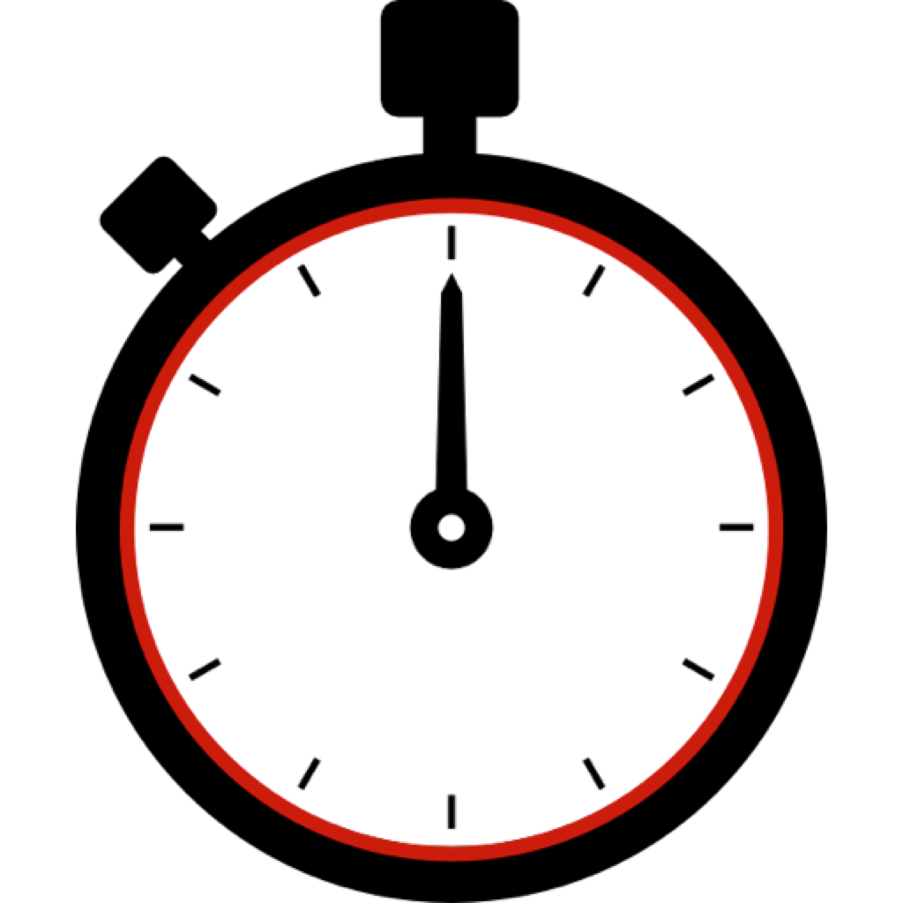

<!--
*** Thanks for checking out the Best-README-Template. If you have a suggestion
*** that would make this better, please fork the repo and create a pull request
*** or simply open an issue with the tag "enhancement".
*** Thanks again! Now go create something AMAZING! :D
-->


<!-- PROJECT SHIELDS -->
<!--
*** I'm using markdown "reference style" links for readability.
*** Reference links are enclosed in brackets [ ] instead of parentheses ( ).
*** See the bottom of this document for the declaration of the reference variables
*** for contributors-url, forks-url, etc. This is an optional, concise syntax you may use.
*** https://www.markdownguide.org/basic-syntax/#reference-style-links
-->
[![Contributors][contributors-shield]][contributors-url]
[![Forks][forks-shield]][forks-url]
[![Stargazers][stars-shield]][stars-url]
[![Issues][issues-shield]][issues-url]
[![MIT License][license-shield]][license-url]


<!-- PROJECT LOGO -->
<br />
<p align="center">
  <a href="https://github.com/mamei16/Mac-GUI-Egg-Timer">
    
  </a>

  <h3 align="center">Mac-GUI-Egg-Timer</h3>

  <p align="center">
    A Simple GUI Countdown Timer for MacOs!
  </p>
</p>


<!-- TABLE OF CONTENTS -->
<details open="open">
  <summary>Table of Contents</summary>
  <ol>
    <li>
      <a href="#about-the-project">About The Project</a>
    </li>
    <li>
      <a href="#getting-started">Getting Started</a>
      <ul>
        <li><a href="#prerequisites">Prerequisites</a></li>
        <li><a href="#installation">Installation</a></li>
      </ul>
    </li>
    <li><a href="#usage">Usage</a></li>
    <li><a href="#contributing">Contributing</a></li>
    <li><a href="#license">License</a></li>
  </ol>
</details>


<!-- ABOUT THE PROJECT -->
## About The Project

[![Product Name Screen Shot][screenshot1]]()

I wrote this little timer application in my second year of university because I was unsatisfied with the 3rd party countdown timers that one could download for MacOs. I wanted a simple, easy to use timer that did not require an internet connection.

Features:
* No artificial upper time limit
* Only requires two mouse clicks, once opened, to start a timer
* The alarm sound won't drive you insane after 2 seconds but is still easily perceivable
* Besides playing a sound, the dock icon will start bouncing once the time has run out

<!-- GETTING STARTED -->
## Getting Started


### Installation

You can choose between a jar file and a standalone application. Both can be downloaded from from [the releases page](https://github.com/mamei16/Mac-GUI-Egg-Timer/releases).

* jar file: 

1. Download the latest jar file 
2. Make sure Java is installed
3. Done! You can now start the app either by double-clicking the jar or by opening the Terminal and running  
  ```sh
  java -jar 'PATH TO THE Timer.jar FILE'
  ```

* dmg file:

1. Download the latest dmg file 
2. This is just your regular MacOs app installation progress, with no special considerations (as far as I'm aware). 
NOTE: This file is much larger (about 200 MB) than the jar file, since it includes a Java runtime to execute the app. 
NOTE2: If you have trouble starting the app after the installation, make sure to read [Issue #1][issue1].


<!-- USAGE EXAMPLES -->
## Usage

To start a timer, simply click the amount of time you want to add to the timer and press 'Start'. You can click a button multiple times if you need to add more time. Clicking 'Stop' before starting the timer will reset the time to zero. Once the time has run out, the alarm signal sounds, the dock icon bounces and the 'Stop' icon flashes red:

[![Product Name Screen Shot2][screenshot2]]()

Just click 'Stop' to stop the alarm. That's all!


<!-- CONTRIBUTING -->
## Contributing

I don't plan to develop this app any futher, but everybody is of course welcome to:

1. Fork the Project
2. Create your Feature Branch (`git checkout -b feature/AmazingFeature`)
3. Commit your Changes (`git commit -m 'Add some AmazingFeature'`)
4. Push to the Branch (`git push origin feature/AmazingFeature`)
5. Enjoy your custom version of the app!


<!-- LICENSE -->
## License

Distributed under the MIT License. See `LICENSE.txt` for more information.


<!-- MARKDOWN LINKS & IMAGES -->
<!-- https://www.markdownguide.org/basic-syntax/#reference-style-links -->
[contributors-shield]: https://img.shields.io/github/contributors/mamei16/Mac-GUI-Egg-Timer.svg?style=for-the-badge
[contributors-url]: https://github.com/mamei16/Mac-GUI-Egg-Timer/graphs/contributors
[forks-shield]: https://img.shields.io/github/forks/mamei16/Mac-GUI-Egg-Timer.svg?style=for-the-badge
[forks-url]: https://github.com/mamei16/Mac-GUI-Egg-Timer/network/members
[stars-shield]: https://img.shields.io/github/stars/mamei16/Mac-GUI-Egg-Timer.svg?style=for-the-badge
[stars-url]: https://github.com/mamei16/Mac-GUI-Egg-Timer/stargazers
[issues-shield]: https://img.shields.io/github/issues/mamei16/Mac-GUI-Egg-Timer.svg?style=for-the-badge
[issues-url]: https://github.com/mamei16/Mac-GUI-Egg-Timer/issues
[license-shield]: https://img.shields.io/github/license/mamei16/Mac-GUI-Egg-Timer.svg?style=for-the-badge
[license-url]: https://github.com/mamei16/Mac-GUI-Egg-Timer/blob/master/LICENSE.txt
[screenshot1]: screenshots/screenshot1.png
[screenshot2]: screenshots/screenshot2.png
[issue1]: https://github.com/mamei16/Mac-GUI-Egg-Timer/issues/1
